# 시스템 기획서 (System Specification)

---

## 🎯 Quick Visual Overview (한눈에 보기)

> **Game Planner**: AI가 게임 컨셉을 전문가 수준의 GDD로 변환합니다.

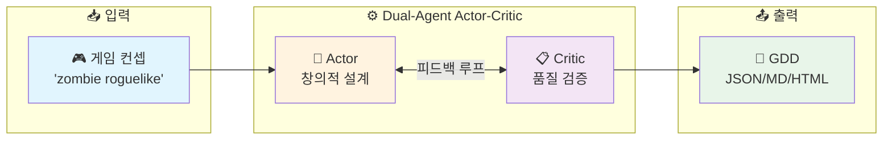

| 핵심 지표 | 값 |
|:---:|:---:|
| ⏱️ 생성 시간 | ~30초 |
| 🔄 자동 수정 | 최대 3회 |
| ✅ 테스트 커버리지 | 94% |
| 📊 총 테스트 | 245개 |

---

## 1. 시스템 개요 (System Overview)

**Game Planner**는 Dual-Agent Actor-Critic 아키텍처를 활용하여 간단한 게임 컨셉을 포괄적인 Game Design Document(GDD)로 자동 변환하는 AI 기반 시스템입니다.

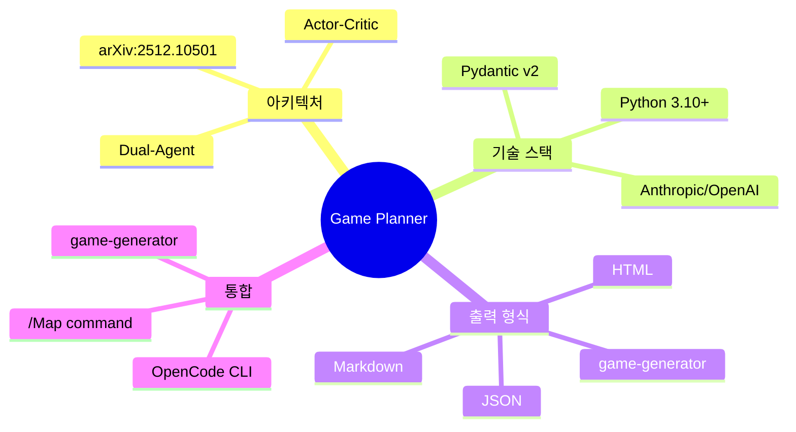

| 항목 | 설명 |
|------|------|
| **시스템 명칭** | Game Planner (Automatic GDD Generator) |
| **아키텍처** | Dual-Agent Actor-Critic (arXiv:2512.10501 기반) |
| **핵심 기술** | Python 3.10+, Pydantic v2, Anthropic/OpenAI API |
| **출력 형식** | JSON, Markdown, HTML, game-generator 프롬프트 |
| **통합 대상** | OpenCode CLI, game-generator, /Map command |

---

## 2. 핵심 설계 원칙 (Design Pillars)

> **각 설계 원칙은 시스템의 품질을 보장하는 기둥입니다.**

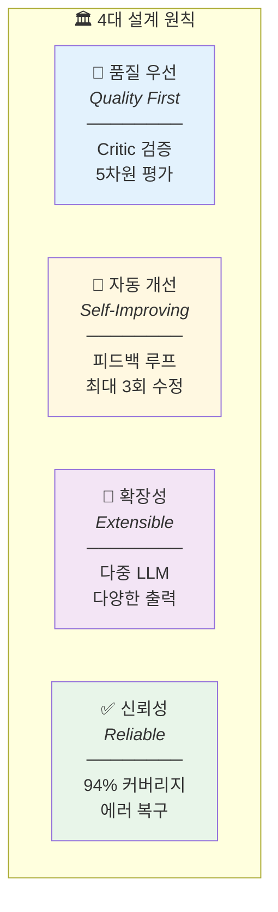

| 원칙 | 구현 방법 | 검증 지표 |
|:---:|:---|:---|
| **품질 우선** | Critic Agent의 5차원 평가 프레임워크 | 평균 점수 7.0+ 승인 |
| **자동 개선** | Actor-Critic 피드백 루프 | 수정 후 품질 향상률 |
| **확장성** | Provider 추상화, 다중 출력 포맷 | 3개 LLM, 5개 출력 형식 |
| **신뢰성** | 지수 백오프 재시도, Fallback GDD | 94% 테스트 커버리지 |

---

## 3. 컴포넌트 아키텍처 (Component Architecture)

```mermaid
graph TB
    subgraph EntryPoints["진입점 (Entry Points)"]
        CLI[main.py<br/>CLI Entry Point]
        OC[GamePlan.md<br/>OpenCode Slash Command]
    end

    subgraph CoreEngine["핵심 엔진 (Core Engine)"]
        ORCH[orchestrator.py<br/>GamePlanningOrchestrator]
        
        subgraph Agents["Agent Layer"]
            ACTOR[Actor Agent<br/>Game Designer<br/>t=0.6]
            CRITIC[Critic Agent<br/>Game Reviewer<br/>t=0.2]
        end
        
        PROMPTS[prompts.py<br/>System Prompts]
    end

    subgraph DataLayer["데이터 계층 (Data Layer)"]
        MODELS[models.py<br/>Pydantic Models]
        CONFIG[config.yaml<br/>Configuration]
    end

    subgraph LLMLayer["LLM 계층 (LLM Layer)"]
        LLM[llm_provider.py<br/>Provider Abstraction]
        ANTH[AnthropicProvider]
        OPENAI[OpenAIProvider]
        MOCK[MockLLMProvider]
    end

    subgraph OutputLayer["출력 계층 (Output Layer)"]
        JSON_OUT[JSON Output]
        MD_OUT[Markdown Output]
        HTML_OUT[HTML Visualization]
        GG_OUT[game-generator Prompt]
        MAP_OUT[/Map Hints]
    end

    CLI --> ORCH
    OC --> ORCH
    ORCH --> ACTOR
    ORCH --> CRITIC
    ACTOR --> PROMPTS
    CRITIC --> PROMPTS
    ORCH --> MODELS
    ORCH --> LLM
    LLM --> ANTH
    LLM --> OPENAI
    LLM --> MOCK
    MODELS --> JSON_OUT
    MODELS --> MD_OUT
    MODELS --> HTML_OUT
    MODELS --> GG_OUT
    MODELS --> MAP_OUT
    CONFIG --> ORCH
    CONFIG --> LLM
```

---

## 4. 데이터 모델 계층 (Data Models)

> **Pydantic v2 기반의 타입 안전한 데이터 모델 계층 구조**

### 4.1 모델 계층 구조 (Class Hierarchy)

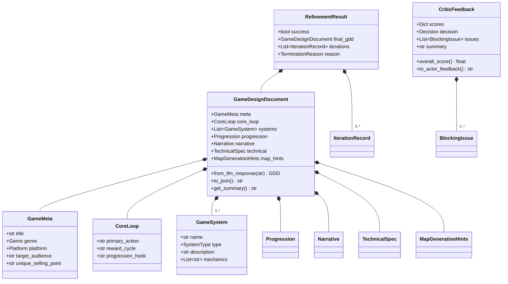

### 4.2 모델 카테고리 요약

| 카테고리 | 클래스/Enum | 설명 |
|:--------:|-------------|------|
| **Core Enums** | `Genre`, `Platform`, `GameEngine`, `ArtStyle` | 게임 메타데이터 타입 정의 |
| **Design Enums** | `ProgressionType`, `SystemType`, `BiomeType`, `NarrativeDelivery` | 게임 디자인 요소 타입 정의 |
| **Agent Enums** | `Severity`, `Decision`, `TerminationReason` | Dual-Agent 피드백 타입 정의 |
| **GDD Models** | `GameMeta`, `CoreLoop`, `GameSystem`, `Progression`, `Narrative`, `TechnicalSpec` | GDD 핵심 섹션 모델 |
| **Support Models** | `Milestone`, `Character`, `Risk`, `MapGenerationHints` | 보조 데이터 모델 |
| **Agent Models** | `CriticFeedback`, `BlockingIssue`, `IterationRecord`, `RefinementResult` | Dual-Agent 출력 모델 |
| **Root Model** | `GameDesignDocument` | 최상위 GDD 통합 모델 (min 3 systems, min 5 milestones) |

### 4.3 핵심 메서드

```python
# GDD 파싱 및 직렬화
GameDesignDocument.from_llm_response(json_str) -> GameDesignDocument
GameDesignDocument.to_json(indent=2) -> str
GameDesignDocument.get_summary() -> str

# Critic 피드백 변환
CriticFeedback.to_actor_feedback() -> str  # Actor 수정용 포맷
CriticFeedback.overall_score -> float      # 가중 평균 점수 (1-10)

# Map 통합
MapGenerationHints.to_map_command_args() -> str  # /Map 명령어 인자
```

---

## 5. 오케스트레이션 계층 (Orchestration Layer)

> **Dual-Agent Actor-Critic 알고리즘의 실행 흐름을 관리합니다.**

### 5.1 Refinement 상태 다이어그램

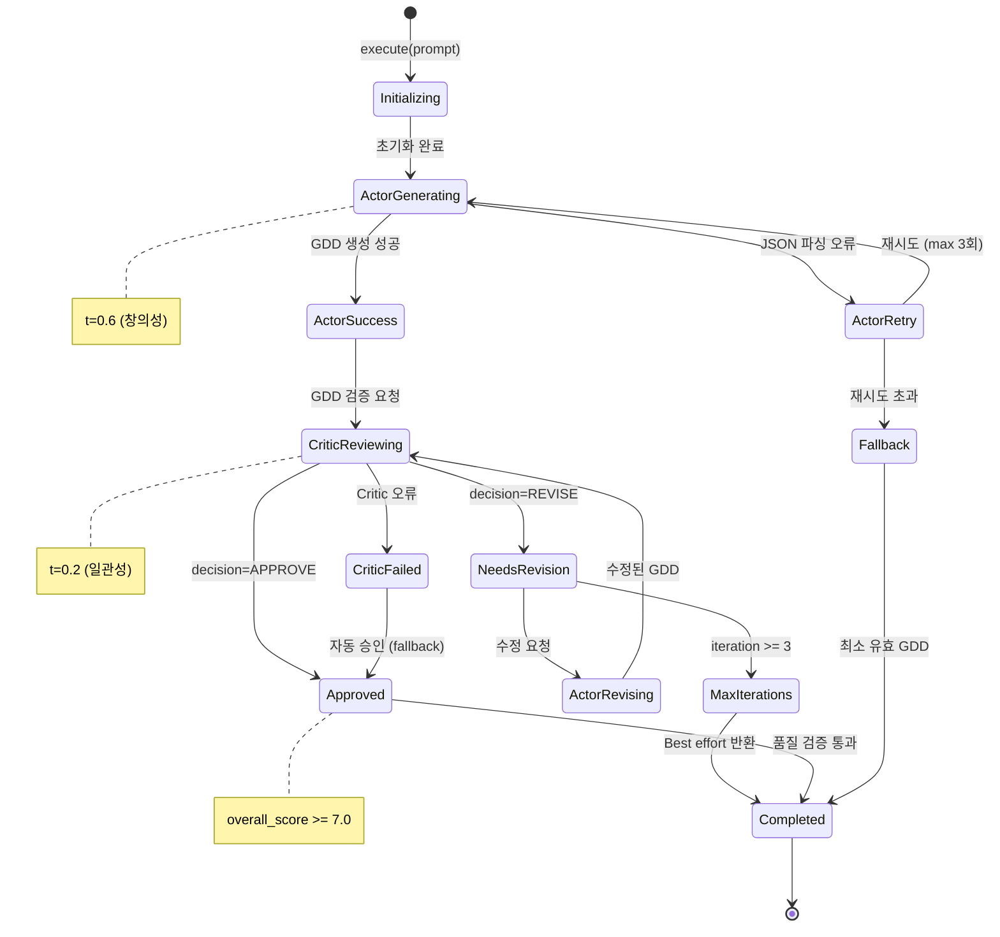

### 5.2 설정 파라미터

| 파라미터 | 타입 | 기본값 | 설명 |
|:--------:|:----:|:------:|------|
| `max_iterations` | int | 3 | 최대 수정 반복 횟수 |
| `actor_temperature` | float | 0.6 | Actor(창의성) 온도 |
| `critic_temperature` | float | 0.2 | Critic(일관성) 온도 |
| `max_tokens` | int | 8192 | 최대 토큰 수 |
| `actor_timeout_ms` | int | 120000 | Actor 타임아웃 (2분) |
| `critic_timeout_ms` | int | 60000 | Critic 타임아웃 (1분) |
| `max_retries` | int | 3 | 최대 재시도 횟수 |
| `retry_backoff_base` | float | 2.0 | 지수 백오프 베이스 |

### 5.3 핵심 인터페이스

```python
class GamePlanningOrchestrator:
    def __init__(self, llm_provider: BaseLLMProvider, config: OrchestratorConfig = None)
    
    async def execute(self, user_prompt: str) -> RefinementResult:
        """
        Algorithm 1 (arXiv:2512.10501 적용):
        1. GDD_0 ← Actor(P_user)           # 초기 GDD 생성
        2. for i in range(K):              # K = max_iterations
           a. Feedback ← Critic(GDD_i)     # Critic 평가
           b. if Feedback.decision == "approve": return GDD_i
           c. GDD_{i+1} ← Actor(GDD_i, Feedback)  # 수정
        3. return GDD_K (best effort)
        """
    
    async def _invoke_actor(self, prompt: str) -> Tuple[GameDesignDocument, LLMResponse]
    async def _invoke_critic(self, prompt: str) -> Tuple[CriticFeedback, LLMResponse]
```

---

## 6. LLM 추상화 계층 (LLM Provider Layer)

> **다양한 LLM 백엔드를 지원하는 추상화 계층**

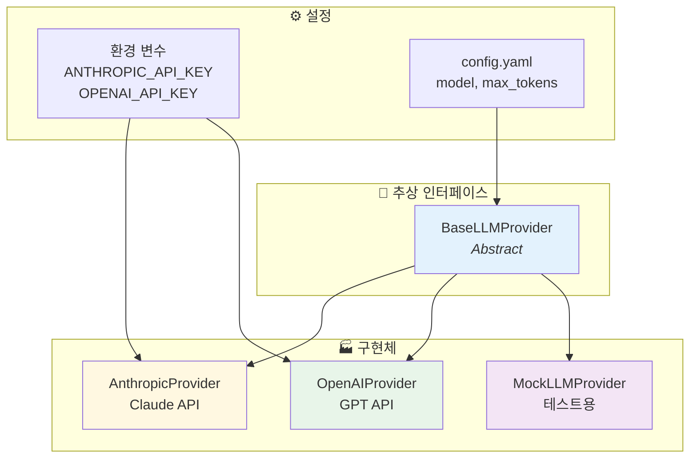

**LLMResponse 응답 구조:**

| 필드 | 타입 | 설명 |
|:----:|:----:|------|
| `content` | str | LLM 응답 텍스트 |
| `input_tokens` | int | 입력 토큰 수 |
| `output_tokens` | int | 출력 토큰 수 |
| `model` | str | 사용된 모델 명 |
| `latency_ms` | float | 응답 지연 시간 |
| `finish_reason` | str | 종료 사유 |

**핵심 함수:**
```python
def create_provider(provider_type: str, **kwargs) -> BaseLLMProvider
def extract_json(text: str) -> str  # Markdown 코드 블록에서 JSON 추출
def load_config(config_path: Path = None) -> Dict[str, Any]
```

---

## 7. 프롬프트 계층 (Prompt Layer)

> **Actor/Critic Agent의 시스템 프롬프트 및 메시지 생성**

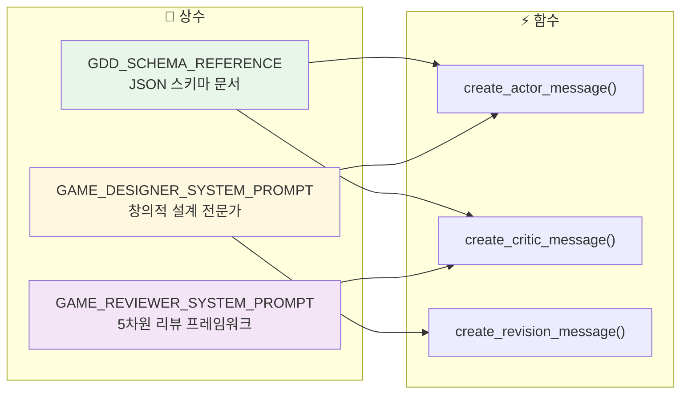

| 상수 | 용도 | 특징 |
|:----:|------|------|
| `GDD_SCHEMA_REFERENCE` | GDD JSON 스키마 문서 | Actor/Critic 모두 참조 |
| `GAME_DESIGNER_SYSTEM_PROMPT` | Actor 시스템 프롬프트 | 창의적 게임 설계 전문가 역할 |
| `GAME_REVIEWER_SYSTEM_PROMPT` | Critic 시스템 프롬프트 | 5차원 리뷰 프레임워크 포함 |

**프롬프트 생성 함수:**
```python
def create_actor_message(user_prompt: str) -> str
def create_critic_message(user_prompt: str, gdd_json: str) -> str
def create_revision_message(previous_gdd: str, critic_feedback: str) -> str
```

---

## 8. CLI 계층 (Command Line Interface)

> **사용자와 시스템 간의 상호작용을 담당하는 명령줄 인터페이스**

### 8.1 CLI 명령어 흐름

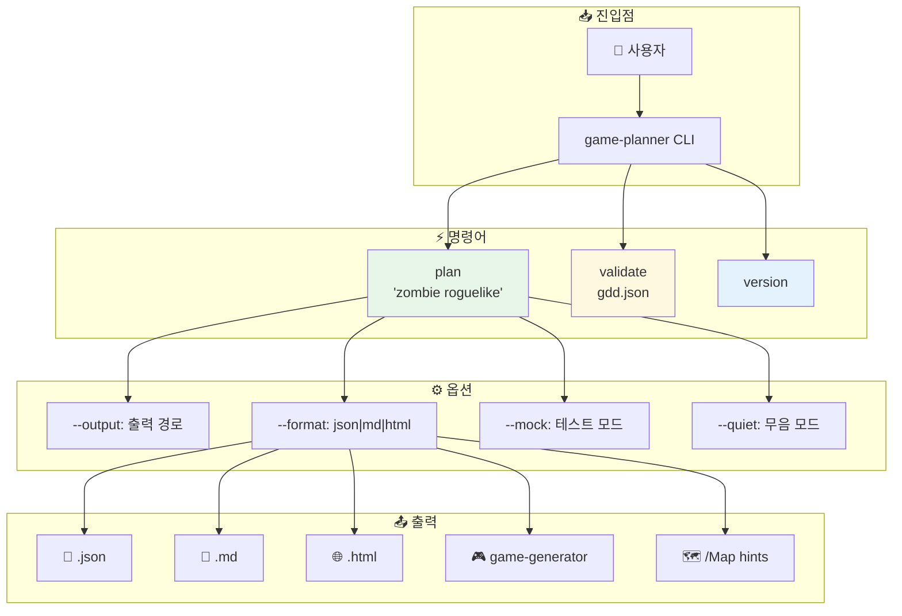

### 8.2 명령어 요약

| 명령어 | 설명 | 주요 옵션 |
|:------:|------|-----------|
| `plan <prompt>` | GDD 생성 | `--output`, `--format`, `--mock`, `--quiet` |
| `validate <file>` | GDD 검증 | JSON 스키마 유효성 검사 |
| `version` | 버전 출력 | - |

### 8.3 출력 포맷

| 포맷 | 설명 | 파일 확장자 | 용도 |
|:----:|------|:-----------:|------|
| `json` | 구조화된 JSON | `.json` | 프로그래밍 통합 |
| `markdown` | 가독성 높은 문서 | `.md` | 문서화 |
| `html` | 시각적 웹 문서 | `.html` | 프레젠테이션 |
| `game-generator` | browser game 프롬프트 | `.txt` | 게임 생성 |
| `map-hints` | /Map 명령어 인자 | `.txt` | 맵 생성 |

---

## 9. 데이터 흐름 (Data Flow)

```mermaid
sequenceDiagram
    participant User
    participant CLI as main.py
    participant Orch as Orchestrator
    participant Actor as Game Designer
    participant Critic as Game Reviewer
    participant LLM as LLM Provider
    participant Output as Output Formatter

    User->>CLI: plan "zombie roguelike"
    CLI->>Orch: execute(user_prompt)
    
    Note over Orch: Iteration 0
    Orch->>Actor: create_actor_message(prompt)
    Actor->>LLM: generate(system_prompt, user_prompt, t=0.6)
    LLM-->>Actor: LLMResponse
    Actor->>Orch: GameDesignDocument (GDD_0)
    
    loop Max 3 iterations
        Orch->>Critic: create_critic_message(prompt, GDD_json)
        Critic->>LLM: generate(system_prompt, review_prompt, t=0.2)
        LLM-->>Critic: LLMResponse
        Critic->>Orch: CriticFeedback
        
        alt Decision == APPROVE
            Orch-->>CLI: RefinementResult(success=True)
        else Decision == REVISE
            Orch->>Actor: create_revision_message(GDD, feedback)
            Actor->>LLM: generate(revision_prompt, t=0.6)
            LLM-->>Actor: LLMResponse
            Actor->>Orch: GameDesignDocument (GDD_{i+1})
        end
    end
    
    Orch-->>CLI: RefinementResult(success=False, best_effort)
    CLI->>Output: format_output(GDD, format_type)
    Output-->>User: JSON/Markdown/HTML
```

---

## 10. Critic 5차원 리뷰 프레임워크 (5-Dimension Review Framework)

> **Critic Agent가 GDD를 평가하는 5가지 핵심 차원**

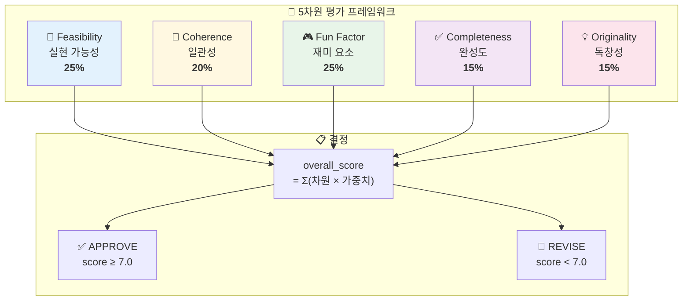

### 10.1 평가 차원 상세

| 차원 | 가중치 | 평가 기준 | 점수 범위 |
|:----:|:------:|-----------|:---------:|
| **Feasibility** | 25% | 합리적 자원/시간 내 구현 가능성, 기술적 복잡도 적절성 | 1-10 |
| **Coherence** | 20% | 시스템 간 논리적 연결, 코어 루프와 부가 시스템 조화 | 1-10 |
| **Fun Factor** | 25% | 코어 루프 매력도, 플레이어 동기 부여 충분성 | 1-10 |
| **Completeness** | 15% | 모든 필수 GDD 섹션 포함, 누락 정보 없음 | 1-10 |
| **Originality** | 15% | 차별화된 USP 존재, 시장 경쟁력 | 1-10 |

### 10.2 Issue Severity 정의

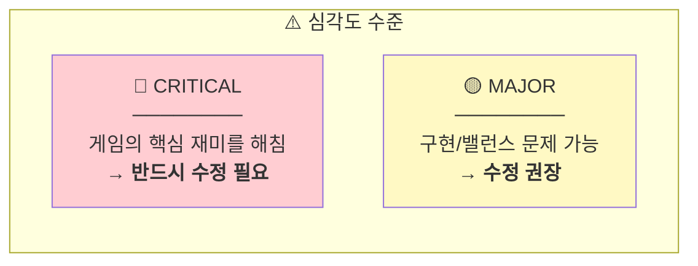

---

## 11. 에러 처리 전략 (Error Handling Strategy)

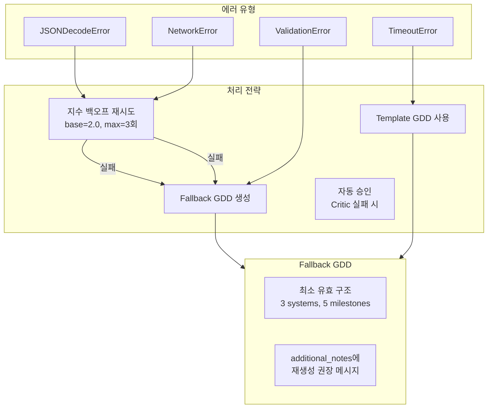

**재시도 로직:**
```python
# 지수 백오프: 1s → 2s → 4s
for attempt in range(max_retries):
    try:
        return await llm_provider.generate(...)
    except (JSONDecodeError, NetworkError):
        await asyncio.sleep(backoff_base ** attempt)
```

---

## 12. 설정 명세 (Configuration Specification)

**config.yaml 구조:**
```yaml
orchestrator:
  max_iterations: 3           # 최대 수정 반복 횟수
  actor_temperature: 0.6      # Actor 창의성 (0.0-1.0)
  critic_temperature: 0.2     # Critic 일관성 (0.0-1.0)

llm:
  provider: "anthropic"       # anthropic | openai | mock
  model: "claude-sonnet-4-20250514"
  max_tokens: 8192

timeouts:
  actor_ms: 120000            # Actor 타임아웃 (2분)
  critic_ms: 60000            # Critic 타임아웃 (1분)

retries:
  max_attempts: 3             # 최대 재시도 횟수
  backoff_base: 2.0           # 지수 백오프 베이스

output:
  default_format: "json"      # json | markdown
  include_map_hints: true     # /Map 힌트 포함 여부
```

**환경 변수:**
| 변수명 | 필수 | 설명 |
|--------|------|------|
| `ANTHROPIC_API_KEY` | provider=anthropic 시 | Anthropic Claude API 키 |
| `OPENAI_API_KEY` | provider=openai 시 | OpenAI GPT API 키 |
| `GAME_PLANNER_DEBUG` | No | 디버그 모드 활성화 |

---

## 13. 통합 인터페이스 (Integration Interfaces)

> **외부 시스템과의 통합을 위한 인터페이스**

### 13.1 통합 아키텍처 개요

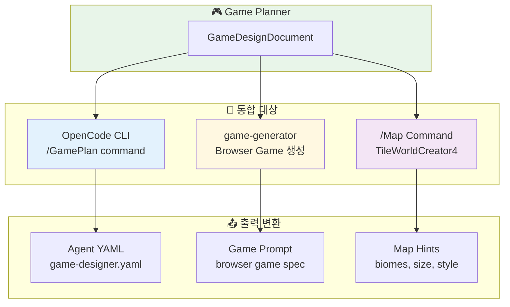

### 13.2 OpenCode 통합

**Agent YAML 설정:**
```yaml
# game-designer.yaml
name: game-designer
model: claude-sonnet-4-20250514
temperature: 0.6
system_prompt: |
  You are an expert Game Designer...

# game-reviewer.yaml  
name: game-reviewer
model: claude-sonnet-4-20250514
temperature: 0.2
system_prompt: |
  You are an expert Game Design Reviewer...
```

**Slash Command:**
```markdown
# GamePlan.md
---
description: "Generate comprehensive GDD from game concept"
argument-hint: "<game-concept>"
---
```

### 13.3 game-generator 통합

**출력 포맷:**
```
Create a [GENRE] game called "[TITLE]".

Core Gameplay:
[Core loop description]

Key Mechanics:
[List of mechanics]

Win Condition: [Based on progression]
Lose Condition: [Based on challenges]

Art Style: [Technical art style]
```

### 13.4 /Map Command 통합

**MapGenerationHints 변환:**
```python
# 입력: GDD.map_hints
# 출력: /Map 명령어 인자
"/Map {biomes}; {size} size; {connectivity} connectivity; {generation_style} style"

# 예시 출력:
"/Map urban,ruins biomes; large size; high connectivity; bsp_dungeon style"
```

---

## 14. 파일 구조 (File Structure)

> **프로젝트 디렉토리 구조와 각 파일의 역할**

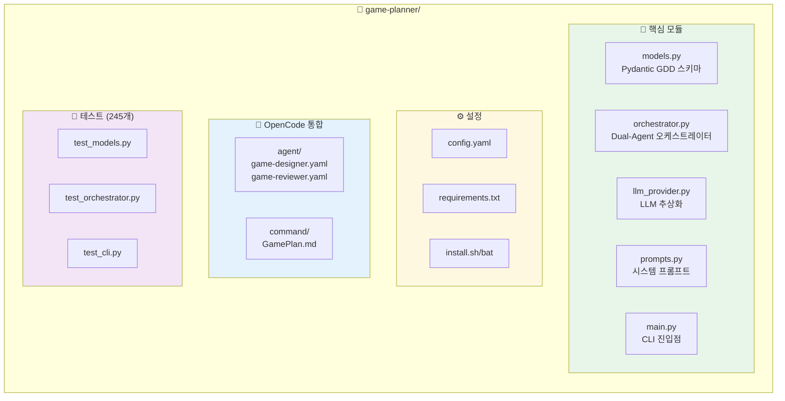

**상세 파일 목록:**

```
game-planner/
├── __init__.py              # 패키지 초기화
├── models.py                # Pydantic GDD 스키마 (1450줄)
├── prompts.py               # Actor/Critic 시스템 프롬프트
├── orchestrator.py          # Dual-Agent 오케스트레이터 (766줄)
├── llm_provider.py          # LLM 추상화 계층
├── main.py                  # Typer CLI 진입점
├── html_template.py         # HTML 시각화 템플릿
├── config.yaml              # 설정 파일
├── requirements.txt         # Python 의존성
├── install.sh / install.bat # 설치 스크립트
├── README.md                # 문서 (925줄)
├── .opencode/
│   ├── agent/
│   │   ├── game-designer.yaml   # Actor 에이전트 설정
│   │   └── game-reviewer.yaml   # Critic 에이전트 설정
│   └── command/
│       └── GamePlan.md          # /GamePlan 슬래시 명령어
└── tests/
    ├── test_models.py           # 모델 테스트 (55개)
    ├── test_prompts.py          # 프롬프트 테스트 (48개)
    ├── test_orchestrator.py     # 오케스트레이터 테스트 (28개)
    ├── test_llm_provider.py     # LLM Provider 테스트 (43개)
    └── test_cli.py              # CLI 테스트 (52개)
```

---

## 15. 품질 메트릭 (Quality Metrics)

> **프로젝트 품질을 측정하는 핵심 지표**

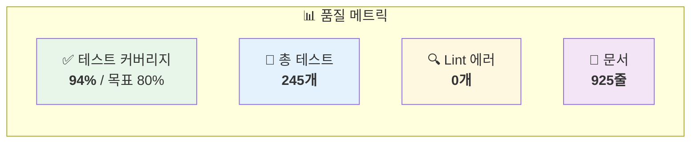

| 메트릭 | 현재 값 | 목표 | 상태 |
|:------:|:-------:|:----:|:----:|
| 테스트 커버리지 | 94% | ≥80% | ✅ |
| 총 테스트 수 | 245개 | - | ✅ |
| Lint 에러 | 0개 | 0개 | ✅ |
| 문서 라인 수 | 925줄 | ≥500줄 | ✅ |
| 커밋 컨벤션 준수 | 100% | 100% | ✅ |

---

## 📚 문서 목차 (Table of Contents)

| # | 섹션 | 설명 |
|:-:|------|------|
| 🎯 | [Quick Visual Overview](#-quick-visual-overview-한눈에-보기) | 시스템 한눈에 보기 |
| 1 | [시스템 개요](#1-시스템-개요-system-overview) | 기본 정보 및 기술 스택 |
| 2 | [핵심 설계 원칙](#2-핵심-설계-원칙-design-pillars) | 4대 설계 원칙 |
| 3 | [컴포넌트 아키텍처](#3-컴포넌트-아키텍처-component-architecture) | 전체 구조도 |
| 4 | [데이터 모델](#4-데이터-모델-계층-data-models) | Pydantic 모델 계층 |
| 5 | [오케스트레이션](#5-오케스트레이션-계층-orchestration-layer) | 상태 다이어그램 |
| 6 | [LLM 추상화](#6-llm-추상화-계층-llm-provider-layer) | Provider 패턴 |
| 7 | [프롬프트](#7-프롬프트-계층-prompt-layer) | 시스템 프롬프트 |
| 8 | [CLI](#8-cli-계층-command-line-interface) | 명령어 흐름 |
| 9 | [데이터 흐름](#9-데이터-흐름-data-flow) | 시퀀스 다이어그램 |
| 10 | [5차원 리뷰](#10-critic-5차원-리뷰-프레임워크-5-dimension-review-framework) | Critic 평가 기준 |
| 11 | [에러 처리](#11-에러-처리-전략-error-handling-strategy) | 복구 전략 |
| 12 | [설정](#12-설정-명세-configuration-specification) | config.yaml |
| 13 | [통합](#13-통합-인터페이스-integration-interfaces) | 외부 시스템 연동 |
| 14 | [파일 구조](#14-파일-구조-file-structure) | 디렉토리 구조 |
| 15 | [품질 메트릭](#15-품질-메트릭-quality-metrics) | 테스트/커버리지 |
